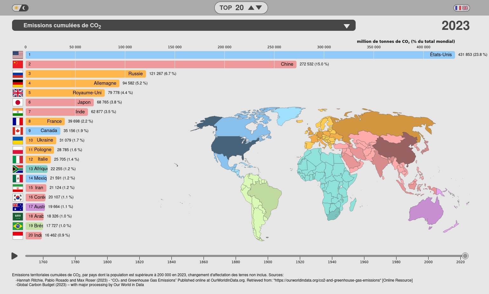
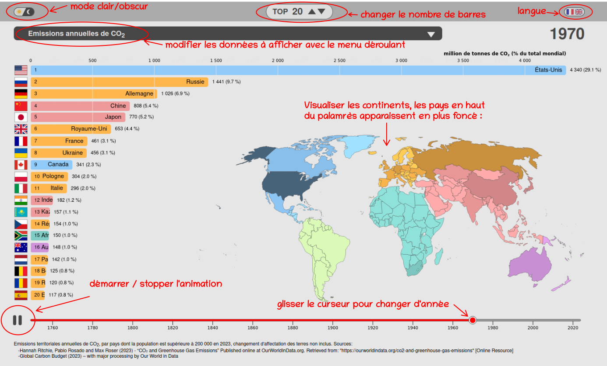

<h1 align="center">Bar Chart Race. Palmarès de population et émissions de CO2 des pays du monde.</h1>
<h1 align="center">Graphique interactif</h1>

### Graphique interactif montrant l'évolution du classement des pays du monde de 1750 à 2023 pour :
<ul>
<li>la population</li>
<li>les émissions de CO2 par année</li>
<li>les émissions de CO2 cumulées depuis 1750</li>
<li>les émissions de CO2 par habitant et par année</li>
<li>les émissions de CO2 par habitant cumulées depuis 1750</li>
</ul>

### Live demo : [ici](https://C-Vellen.github.io/Bar-Chart-Race)

### Mode d'emploi :

 

### Utilisation, personnalisation :
<ol>

<li>Mettre à jour les données :
<ul>
    <li>Télécharger les données : <a href="https://nyc3.digitaloceanspaces.com/owid-public/data/co2/owid-co2-data.csv">ici</a> et les enregistrer dans le dossier <strong>dataset_brut/</strong>
    </li>
    <li>
        Autres données :
        <ul>
        <li>Carte du monde : <strong>staticfolder/world_map.js</strong></li>
        <li>Catalogue des drapeaux des pays en format svg : <strong>dataset_brut/world_countries.csv</strong></li>
        </ul>
    </li>
   
</ul>
</li>

<li>Personnaliser les paramètres d'affichage du graphique:
<ul>
    <li>Ouvrir le notebook <strong>preparation_dataset.ipynb</strong> (environnement python 3.12.10, avec librairie pandas, matplotlib, seaborn, pycountry_convert).</li>
    <li>La cellule <strong>Données sources et paramètres d'affichage</strong> est personnalisable.
    </li>
    <li>Vérifier le nom des fichiers <strong>sourceCSVFiles</strong>.
    </li>
    <li>Enregistrer et exécuter le notebook <strong>preparation_dataset.ipynb</strong>, ce qui va mettre à jour le fichier <strong>staticfolder/dataset.js</strong>.
    </li>
</ul>

<li>
Ouvrir <strong>index.html</strong> dans un navigateur.
</li>

</ol>

### Sources des données utilisées pour ce graphique : [ici](https://ourworldindata.org/co2-emissions)

### Traitement des données : [notebook](preparation_dataset.ipynb)

### code librement inspiré du [notebook](https://observablehq.com/@d3/bar-chart-race-explained)

### Technologies utilisées : 
html, css, javascript + librairie d3js, python + librairies pandas matplotlib seaborn

